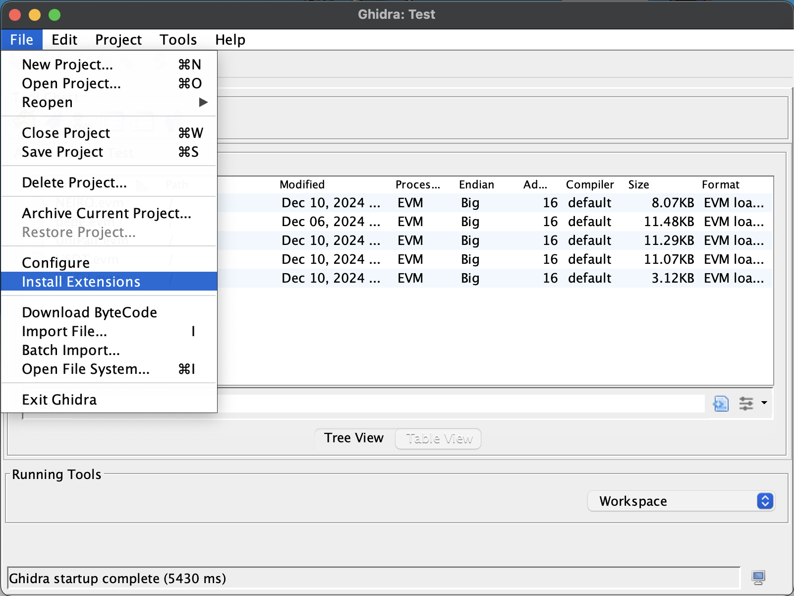
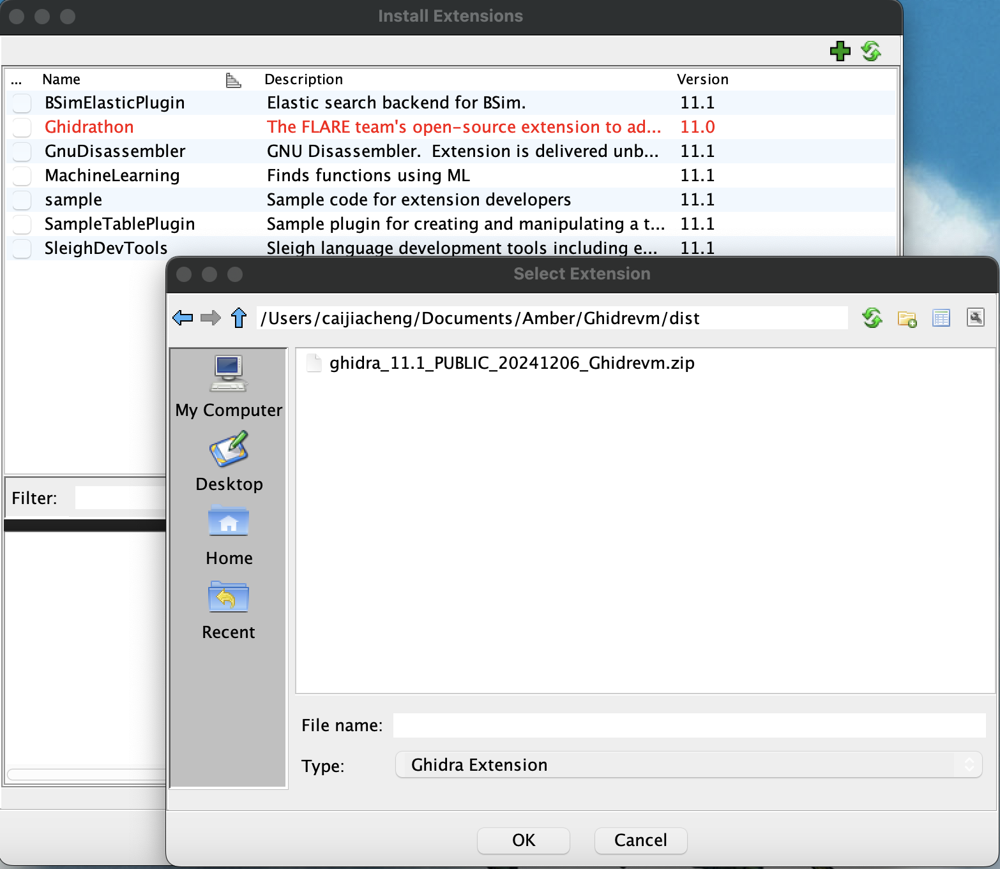
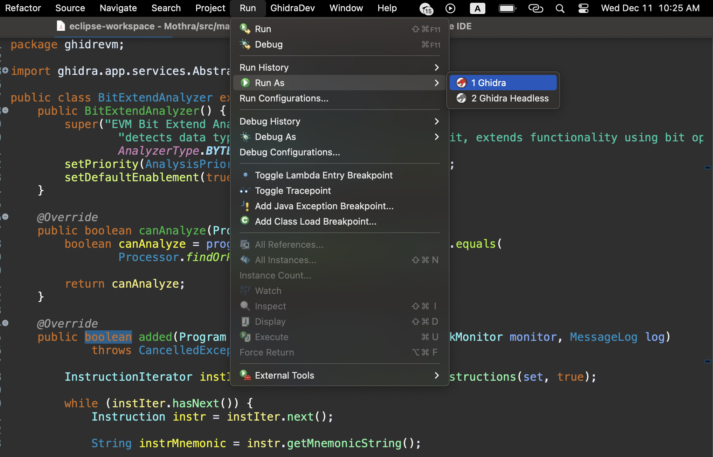
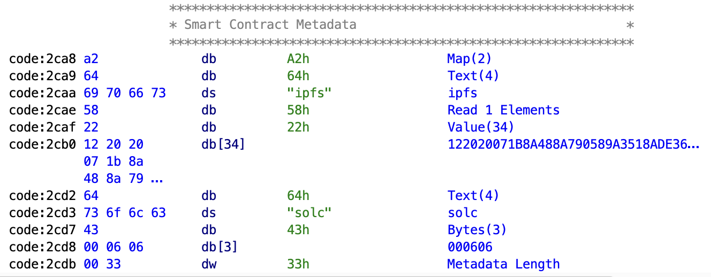
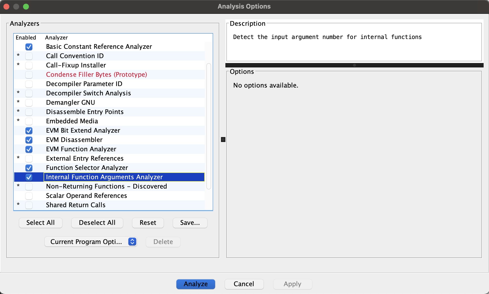

# Mothra

A Ghidra extension that supports EVM bytecode reverse engineering.

- [Mothra](#mothra)
  - [Features](#features)
  - [Installation](#installation)
    - [User](#user)
    - [Developer](#developer)
  - [Usage](#usage)
    - [Loader](#loader)
    - [Analyzer](#analyzer)
  - [Contribution](#contribution)
    - [Fork the Repository](#fork-the-repository)
    - [Create a Branch](#create-a-branch)
    - [Create PR on GitHub](#create-pr-on-github)

## Features

Ghidra is an open-source interactive reverse engineering tool that provides features including disassembly, control flow graphs, decompilation, and scripting support in Java or Python for automated analysis. 

However, it does not natively support the EVM architecture, a big-endian machine with a unique 256-bit word size, unlike traditional architectures such as x86, ARM, or MIPS. 

To address this limitation, Mothra extends Ghidra with support for the 256-bit word size and introduces EVM analyzers to facilitate reverse engineering of EVM bytecode.

+ Supports 256-bit word size for EVM architecture compatibility
+ Compatible with all EVM opcodes, including those introduced in the Cancun upgrade
+ Custom loader enabling users to provide contract addresses or bytecode for analysis
+ Decodes and displays smart contract metadata
+ Identifies all internal function boundaries
+ Determines the number of input arguments for internal functions
+ Detects function dispatch patterns and labels function selectors

## Installation

Download Ghidra, please refers to the `Install` section

### User

1. Download the latest Mothra release package to the `Mothra/dist/` directory.
2. Launch Ghidra using the command `./ghidraRun` (refer to the Ghidra documentation for more details).
3. Navigate to the `File` menu and select `Install Extensions`.
4. Click the green `+` button and choose the zip file downloaded in step 1.
5. Click `OK` and restart Ghidra.
6. Begin reverse engineering with Mothra!

Installation Guidance

Click on the `File` menu and select `Install Extension`.

Click the green `+` button and select the release package.

### Developer
1. Download and install the Eclipse IDE for Java development.
2. Set up the `GhidraDev` extension in Eclipse.
3. Clone or fork this repository to your local machine.
4. In Eclipse, navigate to the `GhidraDev` options, click `Ghidra Module Source`, and select this repository.
5. The repository will appear in the Eclipse IDE.
6. Go to the `Run` menu, select `Run As`, and choose the first option (not the headless option).
7. Mothra will launch - start reverse engineering 
with Mothra!

Installation Guidance

Select the `Run` menu, then choose `Run As`, and pick the first option.

## Usage

### Loader

Our team developed a custom loader that allows users to provide either (1) a contract address or (2) contract bytecode.

To use it, click on the `File` menu and select `Download Bytecode`. The loader supports two modes:

1. `By Address`: Select the network, provide the contract address, enter the desired file name, and click `By Address`.

2. `By Bytecode`: Enter the desired file name, input the contract bytecode, and click `By Bytecode`.

The contract metadata is automatically decoded and displayed. The structure and content of the metadata are detailed here.

### Analyzer

Several analyzers are supported, and their descriptions are provided below:

| Analyzer Name                     | Analyzer Description                                                                                  |
|-----------------------------------|------------------------------------------------------------------------------------------------------|
| EVM Function Analyzer             | Identifies the boundaries for all internal functions.                                                |
| [EVM Bit Extend Analyzer](https://github.com/syjcnss/Mothra/pull/8)           | Detects data types exceeding Ghidra's 64-bit limit, extends functionality using bit operations, and labels them in Mothra for clarity. |
| [Internal Function Arguments Analyzer](https://github.com/syjcnss/Mothra/pull/9) | Detects the number of input arguments for internal functions.                                        |
| [Function Selector Analyzer](https://github.com/syjcnss/Mothra/pull/7)        | Detects function dispatching patterns, extracts function selectors, and labels them for clarity.     |

Analyzer Menu: The analyzers developed by us are selected by default.

## Contribution

Thank you for considering contributing to this project! We welcome contributions of all kinds, including bug fixes, new features, documentation improvements, and more.

There are some guideline for contribution:

### Fork the Repository

+ Fork the project repository by clicking the Fork button on GitHub.
+ Clone your forked repository to your local machine.

### Create a Branch
+ Create a new branch for your changes
+ Use a descriptive name for your branch (e.g., `fix/issue-123` or `feature/add-login`).

### Create PR on GitHub
+ Push your branch to your forked repository
+ Submit a Pull Request
+ describe your changes clearly in the pull request, please include `summary`, `description` and `verification` section.

Examples: [Feat: add function selector analyzer](https://github.com/syjcnss/Mothra/pull/7)